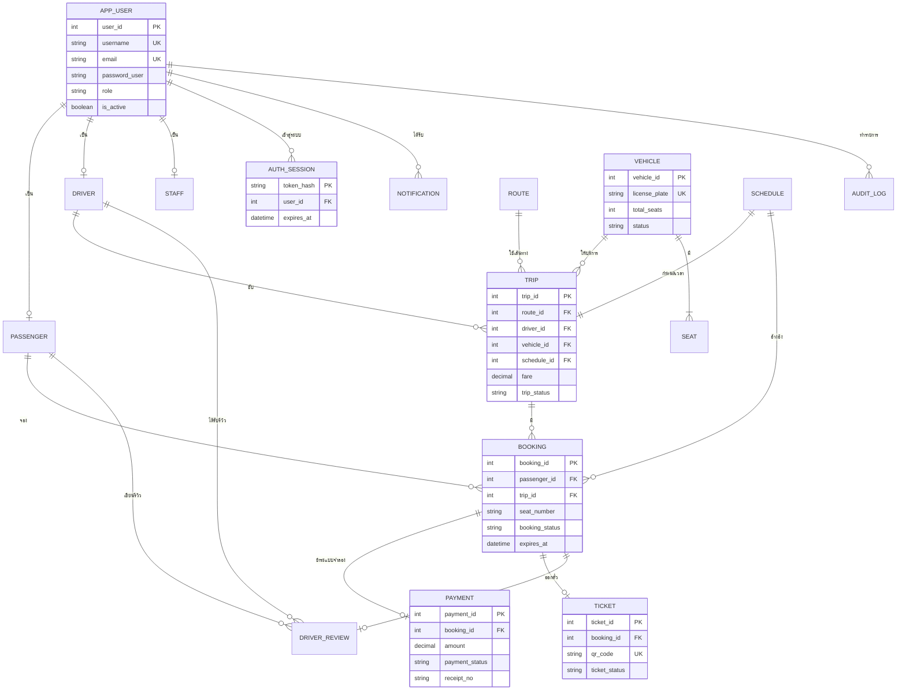

# EveryVan ER Diagram

```mermaid
erDiagram
  APP_USER ||--o| PASSENGER : "เป็น"
  APP_USER ||--o| DRIVER : "เป็น"
  APP_USER ||--o| STAFF : "เป็น"
  APP_USER ||--o{ AUTH_SESSION : "เข้าสู่ระบบ"
  APP_USER ||--o{ NOTIFICATION : "ได้รับ"
  APP_USER ||--o{ AUDIT_LOG : "ทำรายการ"
  ROUTE ||--o{ TRIP : "ใช้เส้นทาง"
  DRIVER ||--o{ TRIP : "ขับ"
  VEHICLE ||--o{ TRIP : "ให้บริการ"
  VEHICLE ||--|{ SEAT : "มี"
  SCHEDULE ||--|| TRIP : "กำหนดเวลา"
  PASSENGER ||--o{ BOOKING : "จอง"
  TRIP ||--o{ BOOKING : "มี"
  SCHEDULE ||--o{ BOOKING : "อ้างอิง"
  BOOKING ||--o| PAYMENT : "ชำระแบบจำลอง"
  BOOKING ||--o| TICKET : "ออกตั๋ว"
  BOOKING ||--o| DRIVER_REVIEW : "รีวิวหลังจบทริป"
  DRIVER ||--o{ DRIVER_REVIEW : "ได้รับรีวิว"
  PASSENGER ||--o{ DRIVER_REVIEW : "เขียนรีวิว"

  APP_USER {
    int user_id PK
    string username UK
    string email UK
    string password_user
    string role
    boolean is_active
  }
  AUTH_SESSION {
    string token_hash PK
    int user_id FK
    datetime expires_at
  }
  VEHICLE {
    int vehicle_id PK
    string license_plate UK
    int total_seats
    string status
  }
  TRIP {
    int trip_id PK
    int route_id FK
    int driver_id FK
    int vehicle_id FK
    int schedule_id FK
    decimal fare
    string trip_status
  }
  BOOKING {
    int booking_id PK
    int passenger_id FK
    int trip_id FK
    string seat_number
    string booking_status
    datetime expires_at
  }
  PAYMENT {
    int payment_id PK
    int booking_id FK
    decimal amount
    string payment_status
    string receipt_no
  }
  TICKET {
    int ticket_id PK
    int booking_id FK
    string qr_code UK
    string ticket_status
  }
```

ข้อบังคับสำคัญ: `uq_active_trip_seat` ป้องกันที่นั่งเดียวกันถูกจองซ้ำในเที่ยวเดียวกัน และ `uq_driver_review_booking` ป้องกันรีวิวเที่ยวเดิมซ้ำ
